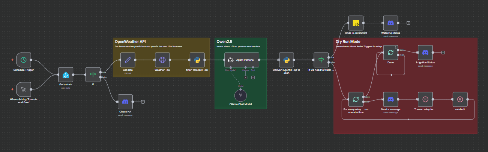
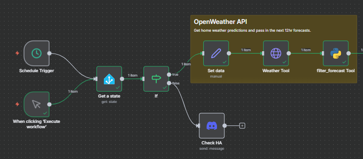
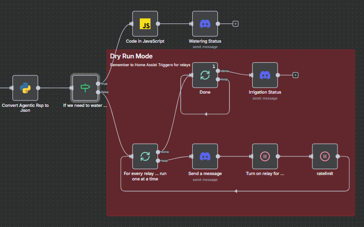

# Smart Irrigation System

This project focuses on designing an AI-assisted smart irrigation system that uses real-time weather data to determine when the yard should be watered.  
The workflow operates autonomously based on a set of rules and environmental conditions, while still involving the user when necessary such as when edge cases, errors, or unusual weather patterns require human confirmation.

---
## **Table of Contents**
* [The Minimal Viable Product](#the-mvp-draft)
* [Continuous Development and Integration](#cicd)

---
## The MVP Draft
For this project, we will use **n8n** to control our Home Assistant sprinkler relays. Before getting started, make sure you have the following:

1. **Home Assistant Long-Lived Access Token**
2. **Ollama credentials** (or any other AI provider credentials)
3. **OpenWeatherAPI credentials** 
4. **Discord (or Telegram) bot token** (optional)




During the MVP design phase, we will temporarily use a **Discord Message** node in place of the actual relay triggers. This allows us to test logic safely without activating the sprinklers.

We pull weather data from the **OpenWeather API**, then clean and reduce the response to only the relevant segments: **the next 12 hours, in 3-hour intervals**. This reduced dataset is passed to the AI agent Pomona, which determines how much watering time each relay zone should receive.

Below is the initial design map:



```
Trigger (Schedule) → Home Assistant Node → IF → True → Pass in API credentials & GPS data (Set Node) → (HTTP Request) → Clean Data → AI Agent

IF → False → Send message (Discord)

```

In this first segment, we set up two triggers - **Schedule** and **Manual** - to start the workflow. Both triggers feed into the Home Assistant node, which attempts to read a known, reliable value from Home Assistant. This is used to check whether Home Assistant is reachable from n8n before we spend time and compute power generating an irrigation determination.

If the check returns **true**, the Set node passes in the OpenWeather API credentials along with the latitude and longitude information for the HTTP request:
```
https://api.openweathermap.org/data/2.5/forecast?lat={{$json.lat}}&lon={{$json.lon}}&appid={{$json.api_key}}&units=imperial
```

This returns 40 items (5 days × 3-hour intervals) from the forecast response.  
We pass this into the Python node for processing, which returns a JSON output with a `message` for the AI agent and a `context` object for the relevant data:

```
code be pasted later
```

If the check returns **false**, we notify the user that there is an issue with Home Assistant and that some intervention is needed.

After we get our response from the AI Agent, we determine whether all relays need to be triggered, or only some, and for how long:
```
code be pasted later
```

If none of the zones need to be skipped, we loop through all the relays and run each one for its assigned duration.



```
AI Agent → Process LLM Response into JSON Items → IF → True → Check Messages → Send Msg (Discord)   
# Irrigation Skipped

IF → False → forloop (Loop over Items) → loop → Dummy Send Msg (Discord) → duration (Delay) → ratelimit (Delay) → loop   
# Looping through relays one at a time

forloop (Loop over Items) → done → once (Loop over Items) → Send Msg (Discord)   
# Summary message sent once
```

The `ratelimit` delay is added to give the relays enough time to switch the solenoids on and off, preventing pressure spikes in the pipes. After the loop finishes, we feed the data into another **Loop over Items**, but this one is configured to run only once so the summary notification is sent a single time. Without this, the automation would send the summary six times - once for every relay in the system.

The result of this automation is kind of "meh." Why, you ask? Well, the very next day when I pushed this live for testing, I realized that while Pomona did its job and provided relay durations based on the weather _at that moment_, those last three words ended up being the problem. Pomona had no memory of previous forecasts, no awareness of earlier conditions, and no way to know whether my concrete was still wet. To be fair, I hadn’t given Pomona a way to track any of that.

This leads us into the next phase: continuous development and integration.

---
## CI/CD

In progress ... come back later.